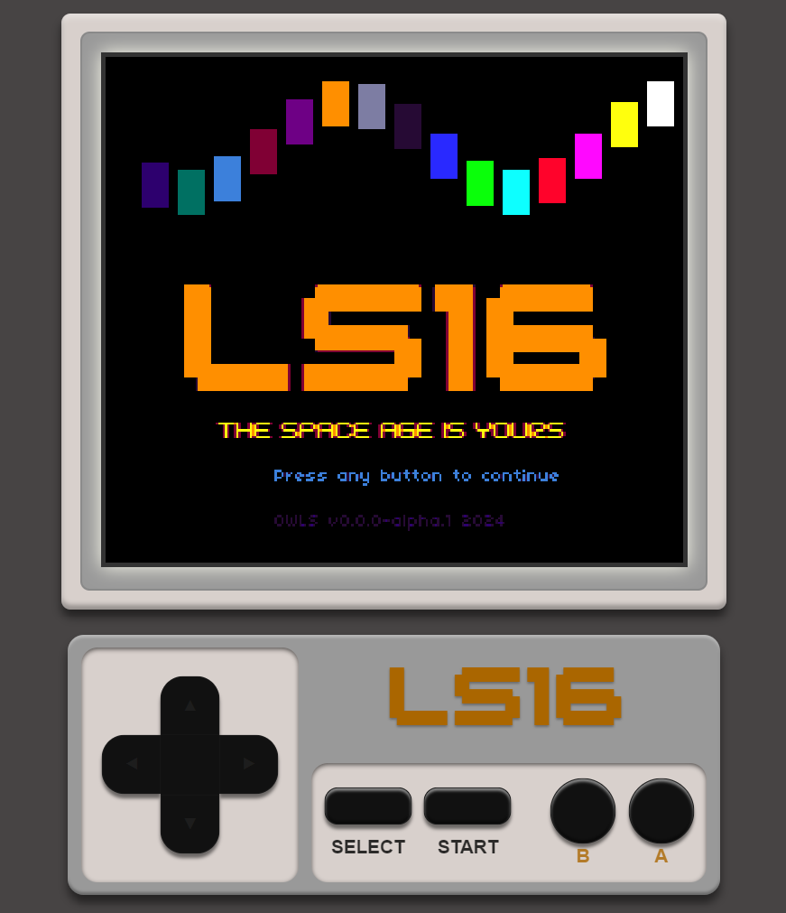
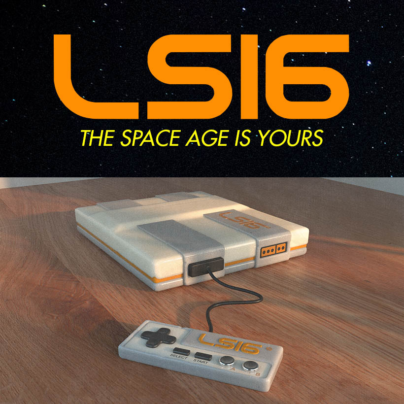

# OWLS16 - Open Web LS16 Fantasy Console

Made for [LoSpec Jam 2](https://itch.io/jam/lospec-jam-2) and [The Tool Jam 4](https://itch.io/jam/the-tool-jam-4) in 2024.

## Try It Out



Try it out: https://morph-games.github.io/owls16

### Controls

See `DEFAULT_KEYMAP` in https://github.com/morph-games/owls16/blob/main/src/console.js#L24

* <kbd>w</kbd>, <kbd>a</kbd>, <kbd>s</kbd>, <kbd>d</kbd>, or arrow keys for movement
* <kbd>n</kbd>,<kbd>q</kbd>, <kbd>z</kbd> for "B" button
* <kbd>m</kbd>,<kbd>e</kbd>, <kbd>x</kbd> for "A" button
* <kbd>[</kbd>. <kbd>Tab</kbd>,<kbd>f</kbd> for Select button
* <kbd>]</kbd>,<kbd>r</kbd> for Start button


### Run it Locally

1. Get the code
1. Make sure you have Node installed
1. `npm install` to install Vite
1. `npm run serve` to start the dev server
1. Open up the url given (e.g, http://localhost:5173/)

#### Customize It - Make your own game

6. Read through at `invaders.js` for an example
1. Make your own cartridge game as a `.js` file (ESM format) - *See below for details*
1. Modify `start.js` to import your cartridge
1. Go back to the page (e.g, http://localhost:5173/), and see your game.

## Fantasy Console Specs



[Fantasy consoles](https://en.wikipedia.org/wiki/Fantasy_video_game_console) are always limited in their scope, meant to mimic older systems. This console has
specific requirements defined by the [LoSpec Jam 2](https://itch.io/jam/lospec-jam-2) rules:

| Official LS Jam Requirements | Status |
|------------------------------|--------|
| 256x224 resolution | ✅ Scaled by 2 |
| 16 color palette [console16](https://lospec.com/palette-list/console16) | ✅ See `colors.js` |
| Colors are not allowed to be mixed, post processing effects are not allowed | ✅ Enforced by a pixel-correction function |
| 8 button controller: 4-way direction page, A, B, Start, Select | ✅ Controller set up with B,A (like NES) rather than A,B


| Optional for LS Jam | Status |
|----------|--------|
| 2 Player support | ✖️ Won't do |
| 4-channel sound ship with Triangle, Pulse, Saw, and Noise generators | ☑️ Using [ZzFX](https://killedbyapixel.github.io/ZzFX/) for sounds, but with no channels |
| 3 built-in fonts | ✅ See css and `fonts.js`
| 16x16 px sprites, 64 on screen at once | ✅ More than 64 silently fails |
| 4 scrolling tiled background layers | ✅ More than 4 silently fails |
| 256x256 px sprite sheets | ✅ Sheets are defined in a `spritesheets` array of Data URLs

<!--
### Required

- 256x224 resolution
- 16 color palette: https://lospec.com/palette-list/console16
- Colors are not allowed to be mixed, post processing effects are not allowed
- 8 button controller: 4-way direction page, A, B, Start, Select

### Optional

- 2 Player support
- 4-channel sound ship with Triangle, Pulse, Saw, and Noise generators
- 3 built-in fonts
- 16x16 px sprites, 64 on screen at once
- 4 scrolling tiled background layers
- 256x256 px sprite sheets
-->

## Terminology

* **Program** = the game logic, written in JavaScript, broken into three main functions:
	- *init* - run once when the program starts
	- *update* - run continuously, ~60 FPS by default (using `setTimeout`)
	- *draw* - run continuously before the browser draws to the screen (`requestAnimationFrame`)
* **Assets** = the materials needed for the game, defined with these properties containing arrays:
	- *sounds* - Array of [ZzFX](https://killedbyapixel.github.io/ZzFX/) arrays
	- *backgrounds* - Array of DataURL strings
		- Images should be 256x256 pixels
	- *spritesheets* - Array of DataURL strings
		- Images should be 256x256 pixels
		- 16x16 pixel sprites will be numbered consecutively from 0, going left to right, top to bottom. 
* **Cartridge** = a set of data for a game that contains assets and a program
	- Currently the only format a cartridge can be is a JavaScript *object*
	- Example:
	```js
	export default {
		name: 'my-cart',
		sounds: [ ... ], // array of ZzFX arrays
		backgrounds: [ ... ], // array of DataURLs, e.g., "data:image/png;base64,iVBORw0KGgoAA..."
		spritesheets: [ ... ] // array of DataURLs
		program: {
			init(api, $state) {
				/* Setup logic */
			},
			update(api, $state) {
				/* Input handling and Game logic */
			},
			draw(api, $state) {
				const { cls, print, spr, bg } = api;
				cls();
				/* Drawing logic */
			},
		},
	};
	```
* **The API** - an object containing all functions and constants that the program can access
	- See below
* **The State** - an object containing any data that you want to pass between `init`, `update`, and `draw`
	- This is initially empty, but can be defined however you'd like.
* **IDs** - Many things - such as colors, buttons, sprites, sounds, and backgrounds - are referenced by numerical IDs referring to index in the array where the data is defined.

## API and Pico-8 Compatibility

The API that is provided to the three main functions contains many functions that act like Pico-8,
and many that are new.

### Legend

| Icon | Meaning |
|------|---------|
| ✅ | Works like Pico-8 |
| ➕ | Bonus parameters or features |
| ⚠️ | Limited functionality or params; oddities |
| ⛔ | Not available |
| 🆕 | New, Non-Pico-8 functionality |

### Basics

* ✅ `cls (colorId)`
* ✅ `print (text, x, y, colorId, fontId)` ➕ Can provide a font Id ⚠️ Adds bordering colors for font 2
* 🆕 `log (...)` - Logs parameters to the console log, but only a limited number of times (to avoid crashing the browser tab)

### Tables, Loops, CoRoutines

⛔ No support for Pico-8 tables or loop functions at the moment. Javascript objects, arrays, and
control statements all work.

### Sprites

* ✅ `spr (spriteId, x, y)` ⚠️ doesn't use w, h, flipX, flipY params
* ⛔ `sget`
* ⛔ `sset`
* 🆕 `bg (backgroundId, x, y, repeat)`
* ⛔ `fget`
* ⛔ `fset`

### Shapes, Pixels

* ⚠️ `rect (x0, y0, x1, y1, colorId)` - Note that this is different than the JavaScript canvas `rect`
* ✅ `rectfill (x0, y0, x1, y1, colorId)`
* ⛔ `circ (x, y, r, colorId)`
* ⛔ `circfill (x, y, r, colorId)`
* ⛔ `line (x0, y0, x1, y1, colorId)`
* ⛔ `pget (x, y)`
* ✅ `pset (x, y, colorId)`

### Colors, Screen

* ⛔ `pal`
* ⛔ `palt`
* ⛔ camera
* ⛔ clip
* ⛔ color

### Tile Maps

* ⛔ map
* ⛔ mget
* ⛔ mset

### Controls

* ✅ `btn (buttonId, player)` ⚠️ player param not used
* ✅ `btnp (buttonId, player)` ⚠️ player param not used; does not repeat if button is held down

### String Manipulation and Types

* ✅ `sub (string, from to)` - just an alias for JavaScript's `.substring()`
* ✅ `type (w)` - just an alias for JavaScript's `typeof`
* ✅ `tostr (w)` - same as `String(w)`
* ✅ `tonum (w)` - same as `Number(w)`

### Sound

* ✅ `sfx (soundId, channel, offset, length)` ⚠️ channel, offset, and length params are not used
* ⛔ `music (n, fade, mask)`

### Math

* ✅ `sin`
* ✅ `cos`
* ✅ `atan2`
* ✅ `abs`
* ✅ `round`
* ✅ `flr`
* 🆕 `floor` (alias)
* ✅ `ceil`
* ✅ `min`
* ✅ `max`
* ✅ `sgn`
* 🆕 `sign` (alias)
* ✅ `sqrt`
* ✅ `mid`
* 🆕 `clamp (number, min = 0, max = 1)`
* 🆕 `lerp (percent, valueA, valueB)`
* 🆕 `mod (dividend, divisor)`

#### Binary

* ✅ `band`, `bnot`, `bor`, `bxor`, `shl`, `shr` - Supported, but deprecated by Pico-8. Use bitwise operators instead.
* Bitwise AND - use `&`
* Bitwise NOT - use `~`
* Bitwise OR - use `|`
* Bitwise XOR - use `^` ⚠️ Different from Pico-8's `^^`
* Shift left - use `<<`
* Shift right - use `>>`
* ⛔ `lshr`

#### Randomness

* ✅ `rnd (limit)` ⚠️ Cannot pass a "table" as a param
* 🆕 `rand (valueA = 1, valueB = 0)` - Generate a random number between two values (optional params)
* 🆕 `randInt (valueA, valueB = 0)` - Generate a random integer between two values (uses `floor`)
* 🆕 `pick (array)` - Pick a random item from an array
* ⛔ `srand (val)`

### Collisions

* 🆕 `aabb ([x1, y1, w1, h1], [x2, y2, w2, h2])` - Is a rectangle (defined by an array of coordinates and size) intersecting with another rectangle?

### Constants

* 🆕 `COLORS` (array)
* ✅ `NIL` === `null`
* 🆕 `SCREEN_WIDTH`
* 🆕 `SCREEN_HEIGHT`


## TODO
### Core Features

- [ ] Fix multi-touch issue - Currently the controller does not work well in

### Wishlist / Ideas

- System UI
	- [ ] Show cartridge in system UI (center)
	- [ ] Show controller cord connection
- [ ] Sample sprites for splash screen
- [ ] Draw to buffer before color correction and final draw
- Tilemaps
- Music
- Allow `btnp` function to get retriggered if button is held down after some delay
- [ ] Fast tap recognition (for mobile)
- Command line interface
- 3D console using CSS (see OWL-BAT)
- cartridges as JSON
- cartridges as images
- Different carts based on how they're saved: "T" = Temp cart (in memory, in development), "B" = Browser (IndexedDB), "M" = Local machine / drive, "S" = Cloud backed-up. Maybe a different color for each?
- Show cartridges in a library
- Ability to share cartridges (as images or JSON files, or via P2P)
- Full compatibility with pico-8
- Support multiple languages, including Lua

## Credits

- LS16 console designed by skeddles, Pixelsnorf, Ty.mp3
- Palette: [Console16](https://lospec.com/palette-list/console16) by [adamPhoebe](https://lospec.com/adamphoebe)
- Fonts: [BM Space](https://www.dafont.com/bm-space.font) by [BitmapMania](https://www.dafont.com/bitmapmania.d283), [BM Japan](https://www.dafont.com/bm-japan.font) by [BitmapMania](https://www.dafont.com/bitmapmania.d283), [04b03](http://04.jp.org/) by [Yuji Oshimoto](http://04.jp.org/)
- Initial development by Morph
